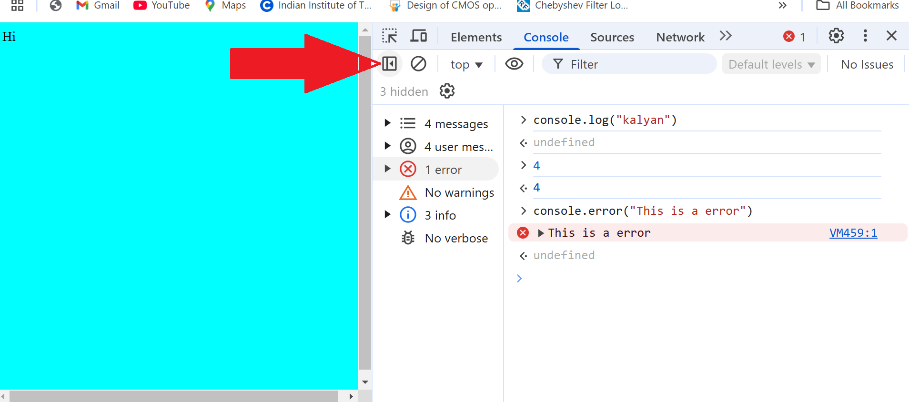

# Console
- Console object has many methods , log is one of them
    - assert() -> used to assert a staement , returns undefined when true else error
    - clear() -> clears the console
    - log() -> outputs a message to the console
    - table() -> displays a tabular data , converts obj to table
    - warn() -> used for warnings
    - error() -> used for errors
    - info() -> for info
    - time("some label") -> starts time
    - timeEnd("some label") -> ends time
    - ```js
        console.log(console)
        console.assert(1===1) // undefiend
        console.assert(1>1) // error
        console.error("This is a error");
        console.clear()
        obj = { a:1 , b:2 , c:3}
        console.table(obj)
        console.time("a")
        for (let i = 0 ; i<100; i++) {
            console.log("hello")
        }
        console.timeEnd("a")
        ```


- Following tab can be used to filter warnings , errros and logs
    - 
